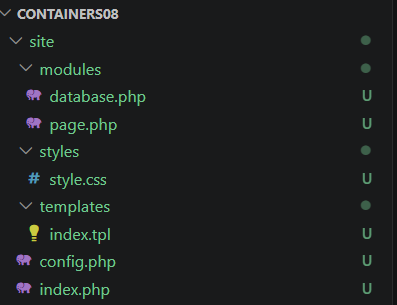
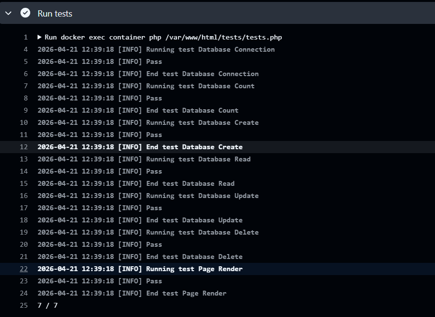

# IWNO8: Непрерывная интеграция с помощью Github Actions

## Цель работы

В рамках данной работы студенты научатся настраивать непрерывную интеграцию с помощью Github Actions.

## Задание

Создать Web приложение, написать тесты для него и настроить непрерывную интеграцию с помощью Github Actions на базе контейнеров.

## Выполнение

В директории containers08 создаю директорию ./site. В директории ./site будет располагаться Web приложение на базе PHP.

### 1. Создание структуры



### 2. Реализация Web-приложения

#### 2.1 modules/database.php

Файл modules/database.php содержит класс Database для работы с базой данных. Для работы с базой данных используйте SQLite. Класс должен содержать методы:

* __construct($path) - конструктор класса, принимает путь к файлу базы данных SQLite;
* Execute($sql) - выполняет SQL запрос;
* Fetch($sql) - выполняет SQL запрос и возвращает результат в виде ассоциативного массива.
* Create($table, $data) - создает запись в таблице $table с данными из ассоциативного массива $data и возвращает идентификатор созданной записи;
    ```php
        public function Create($table, $data) {
        $columns = implode(',', array_keys($data));
        $values = implode(',', array_map(fn($v) => "'$v'", array_values($data)));
        $sql = "INSERT INTO $table ($columns) VALUES ($values)";
        $this->Execute($sql);

        return $this->pdo->lastInsertId();
    }
    ```
* Read($table, $id) - возвращает запись из таблицы $table по идентификатору $id;
* Update($table, $id, $data) - обновляет запись в таблице $table по идентификатору $id данными из ассоциативного массива $data;
* Delete($table, $id) - удаляет запись из таблицы $table по идентификатору $id.

    ```php
    //пример 
        public function Delete($table, $id) {
        $sql = "DELETE FROM $table WHERE id = $id";
        $this->Execute($sql);
    }
    ```
* Count($table) - возвращает количество записей в таблице $table

#### 2.2 modules/page.php

Файл modules/page.php содержит класс Page для работы с страницами. Класс должен содержать методы:

* __construct($template) - конструктор класса, принимает путь к шаблону страницы;

    ```php
        public function __construct($template) {
        $this->template = file_get_contents($template);
    }
    ```
* Render($data) - отображает страницу, подставляя в шаблон данные из ассоциативного массива $data.

    ```php
        public function Render($data) {
        $output = $this->template;
        foreach ($data as $key => $value) {
            $output = str_replace("{{ $key }}", $value, $output);
        }
        return $output;
    }
    ```

#### 2.3 templates/index.tpl, styles/style.css 

Создаём шаблон страницы и стили

#### 2.4 index.php

Остовляем код как в примере для лаб.работы

#### 2.5 config.php

Файл config.php содержит настройки для подключения к базе данных

```php
<?php

$config = [
    "db" => [
        "path" => __DIR__ . '/var/db/db.sqlite'
    ]
];
```

### 3. Подготовка SQL файла для базы данных

Создал в корневом каталоге директорию ./sql. В созданной директории создал файл schema.sql со следующим содержимым:

```sql
CREATE TABLE page (
    id INTEGER PRIMARY KEY AUTOINCREMENT,
    title TEXT,
    content TEXT
);

INSERT INTO page (title, content) VALUES ('Page 1', 'Content 1');
INSERT INTO page (title, content) VALUES ('Page 2', 'Content 2');
INSERT INTO page (title, content) VALUES ('Page 3', 'Content 3');
```

### 4. Создание тестов

Создал в корневом каталоге директорию ./tests. В созданном каталоге создал файл testframework.php со содержимым из описания лаб. работы

#### 4.1 tests.php

В файле tests.php были добавлены тесты для всех методов класса Database:

* testDbConnection - проверка успешного подключения к базе данных
* testDbCount - проверка корректности подсчёта записей в таблице
* testDbCreate - проверка создания новой записи
* testDbRead - проверка чтения записи по идентификатору
* testDbUpdate - проверка обновления данных записи
* testDbDelete - проверка удаления записи

Также был реализован тест для класса Page:

* testPageRender - проверка генерации HTML-страницы на основе шаблона.

### 5. Запуск и тестирование 

После отправки проекта в репозиторий:
* CI автоматически запускается во вкладке Actions
* выполняются все этапы сборки и тестирования 
* при успешном выполнении отображается зелёный статус



## Ответы на вопросы
### 1. Что такое непрерывная интеграция?

Непрерывная интеграция (CI) — это практика разработки, при которой изменения кода автоматически собираются и тестируются при каждом внесении изменений в репозиторий. Это позволяет быстро обнаруживать ошибки и повышает качество программного обеспечения.

### 2. Для чего нужны юнит-тесты? Как часто их нужно запускать?

Юнит-тесты используются для проверки отдельных компонентов программы (функций, методов, классов).

Они позволяют:

* выявлять ошибки на раннем этапе
* предотвращать регрессии
* упрощать рефакторинг кода

Юнит-тесты необходимо запускать:

* при каждом изменении кода
* при каждом коммите
* при каждом Pull Request
* автоматически в CI/CD

### 3. Что нужно изменить, чтобы тесты запускались при Pull Request?

Необходимо добавить в файл main.yml блок:

```
pull_request:
  branches:
    - main
```    
### 4. Как удалять Docker-образы после выполнения тестов?

Необходимо добавить в workflow шаг:

```
- name: Remove Docker image
  run: docker rmi containers08
```  